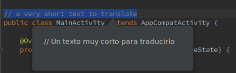

## Plugin for [IntelliJ IDEA](http://plugins.jetbrains.com/plugin/6317?pr=idea plugin) to translate from any language!

Overview
--------

 -> Select text 
 -> Right click
 -> Click Translate
 -> DONE!!!!

Default language is English ("en").

-> File
-> Settings
-> Other Settings
-> Translator
-> Write your desired Language Code
-> Done!

